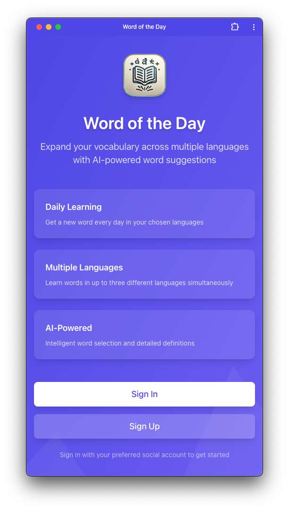
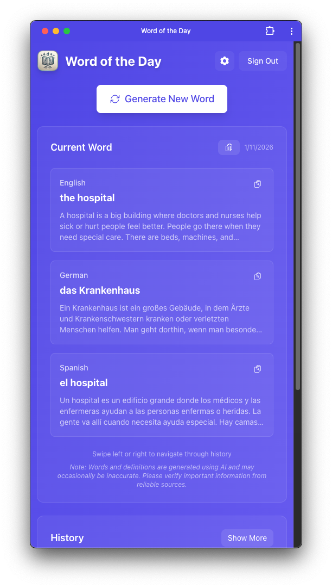
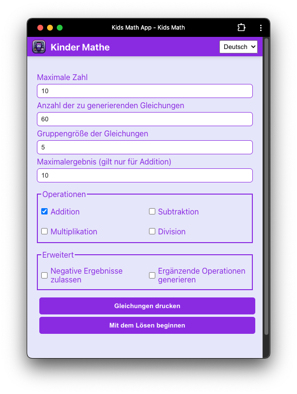

# Recent Projects

Most of my recent work is on private or proprietary codebases and cannot be shared publicly. It includes production-grade backend systems, distributed services, and internal tooling, with a strong focus on system design, performance, and long-term maintainability. While the source code cannot be published, the work reflects industry best practices in architecture, testing, and reliability engineering.

## Word of the Day
A lightweight educational app focused on daily vocabulary building for children. It emphasizes simplicity, consistency, and age-appropriate learning, with careful attention to UX, and content structure. Give it a try here: https://words.ahmadhajjar.me/

  
  

## Kids Math
An interactive math-learning app designed for young learners, focusing on core arithmetic skills through repetition. The project prioritizes clarity, fast feedback, and a distraction-free experience suitable for children. Give it a try here: https://kids-math.ahmadhajjar.me/

  

